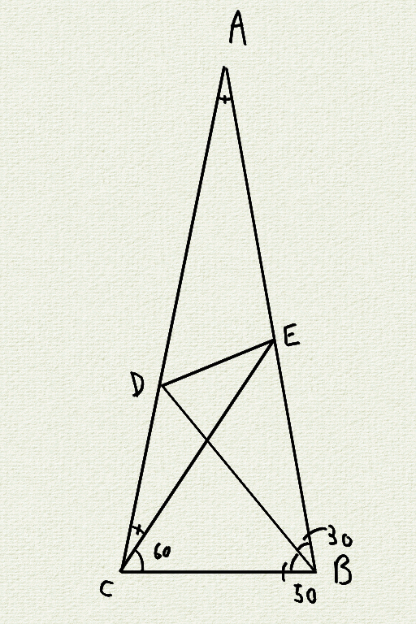
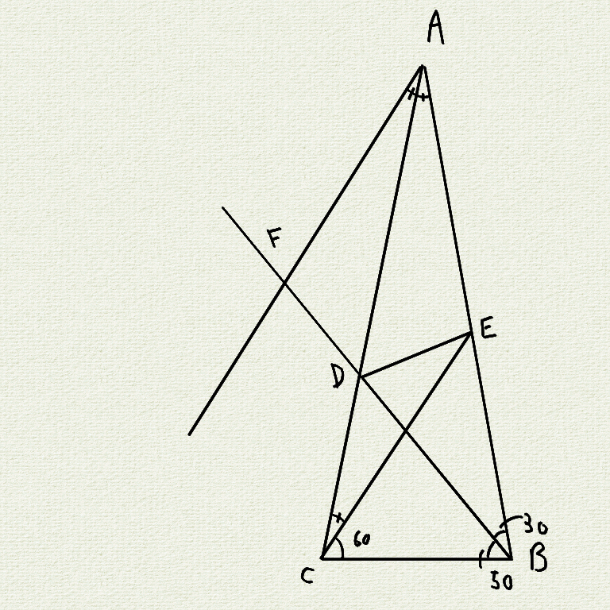
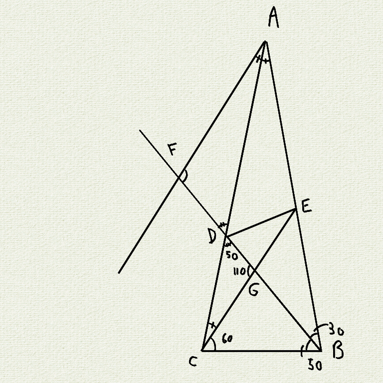
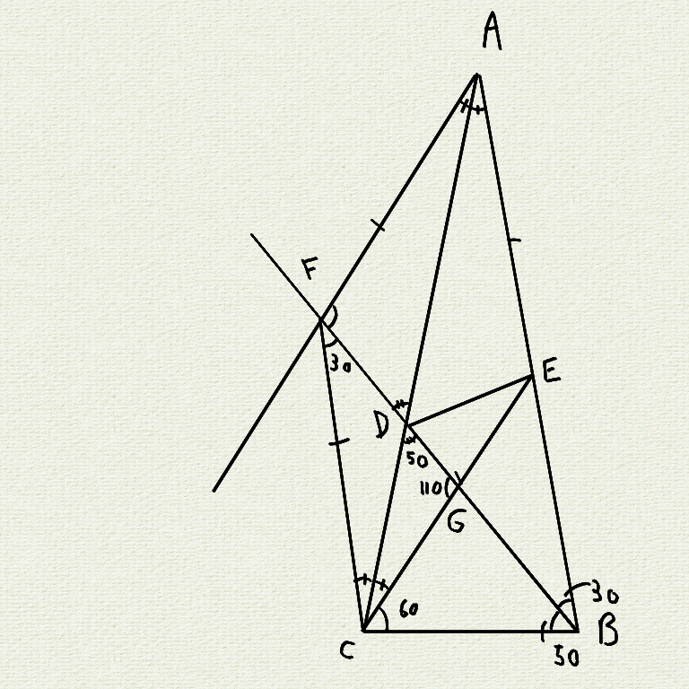
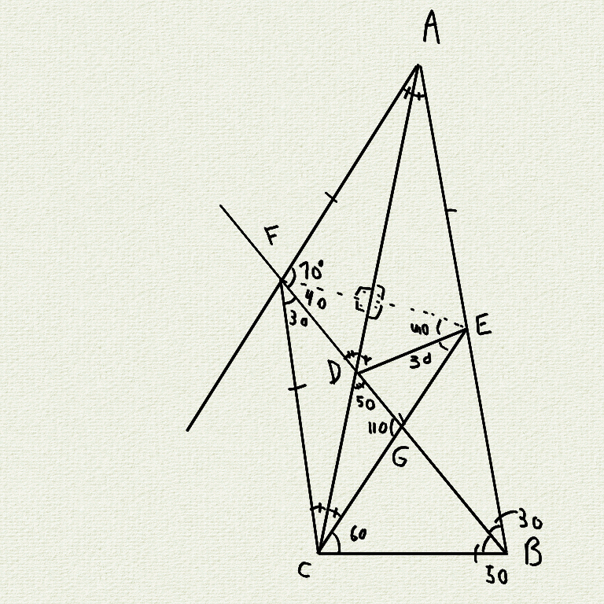

# Solucao

Criar A sendo AC ≡ AD e AE ≡ AB, formando ∆ABC isósceles

Criar F sendo FD ≡ FB e FA // CE

∠CEB = 40 ∴ ∠FAD = 20

∆DFA ∆DGC são semelhantes por compartilharem um ângulo no vértice D e DCG = DAF

Unindo os pontos F e C podemos fazer semelhança entre os triângulos DBA e DFC descobrindo assim DCF = 20 e DFC = 30

Assim descobrimos que AFCE é um losango

x = 30
