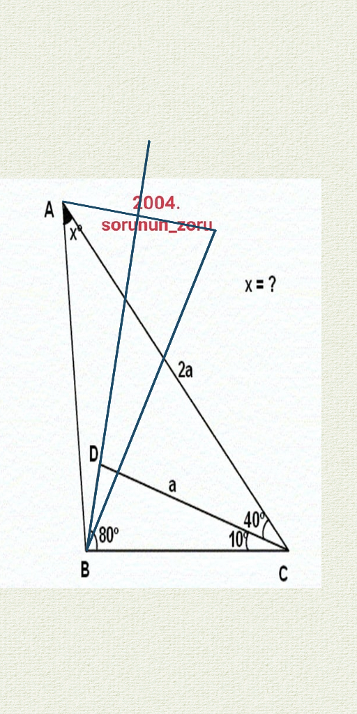
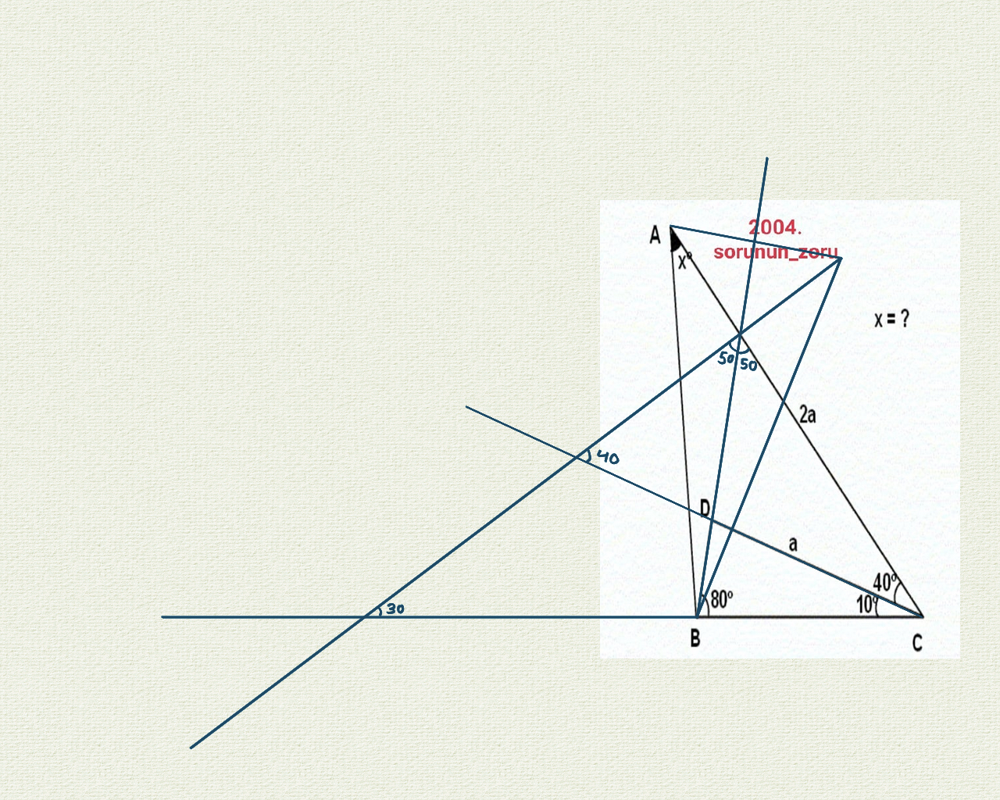
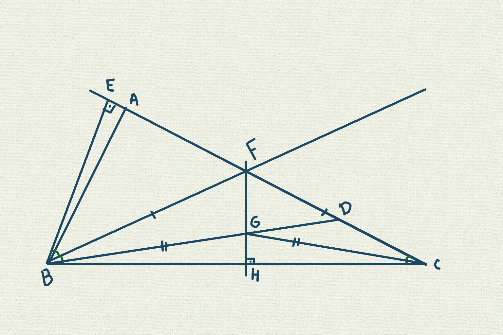
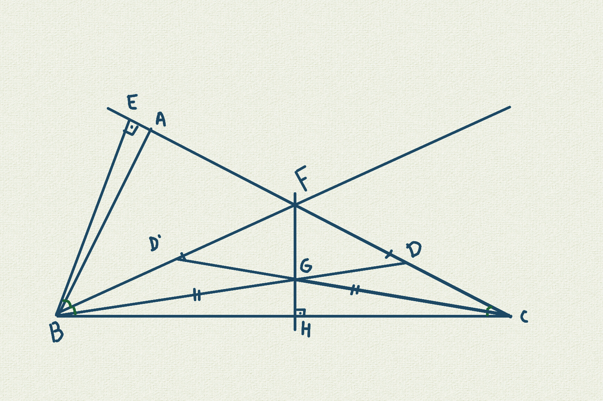
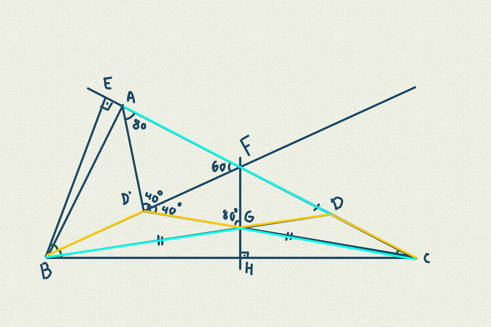
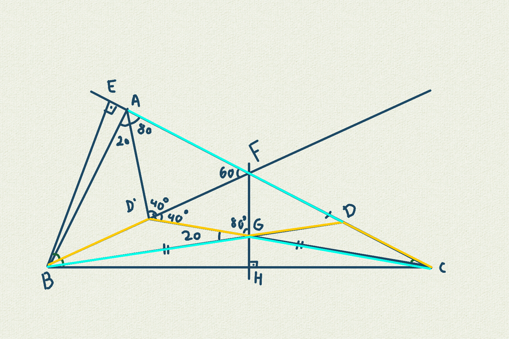

# Solucao

IMAGENS MERAMENTE ILUSTRATIVAS

Prolongar a reta CA e criar BE sendo BE ⊥ CA

Fazer uma bissetriz de ∠EBC no ponto F

Criar um ponto H em CB sendo FH ⊥ CB

∆FBC é isósceles ∴ ∆FHB = ∆FHC

Prolongando a reta CG encontramos D'

Verificando que AD = GC e DC = GD' temos ∠CAD' = ∠CD'A
Assim ∠AD'F = 40 e ∠GD'F = 40
∆AFD' = ∆FGD'

x = 100
